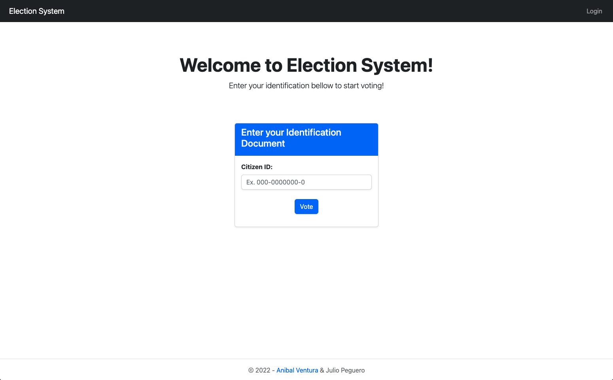
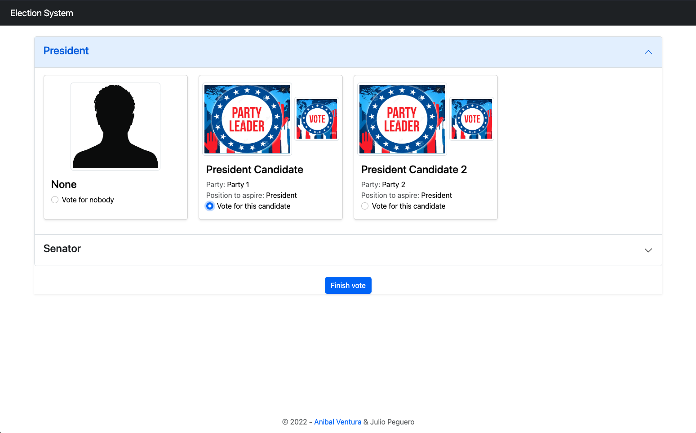
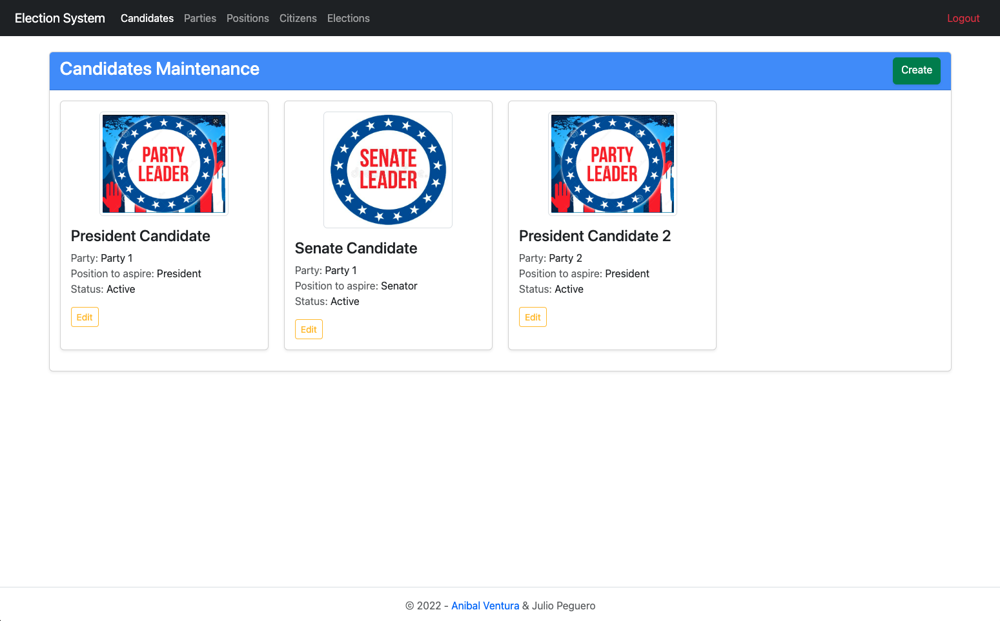
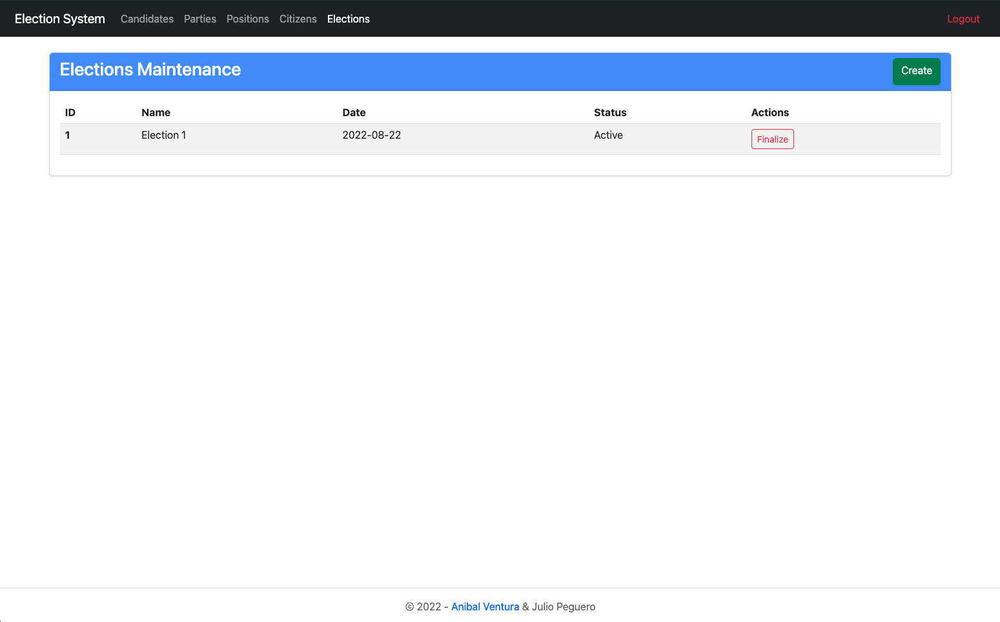

# Election System

[](https://nodejs.org/en/)
[](https://expressjs.com/)
[](https://handlebarsjs.com/)
[](https://sequelize.org/)
[](LICENSE.md)

<p align="center">
  
  
  
  
</p>

Election manager and voting system with CRUD operations and MVC architecture.

## Features

- Home page for citizens to enter their identification document and validate to start voting.
- Register, login, logout an admin user.
- Maintenance pages to perform CRUD operations for admin users.
- Cannot update items on an active election.
- Only one election active at a time.
- Restrictions for start an election and auth routes.
- Data persistance with sequelize(mysql).

### TODO

- [ ] Send email with citizen candidates selection.
- [ ] See election results in admin options.

## Technologies

- HTML / Javascript / Bootstrap
- NodeJS / ExpressJS / Handlebars
- Sequelize / MySQL

## Dependencies

- [bcryptjs ^2.4.3](https://www.npmjs.com/package/bcryptjs)
- [connect-flash ^0.1.1](https://www.npmjs.com/package/connect-flash)
- [express ^4.17.1](https://www.npmjs.com/package/express)
- [express-handlebars ^5.3.2](https://www.npmjs.com/package/express-handlebars)
- [multer ^1.4.5-lts.1](https://www.npmjs.com/package/multer)
- [mysql2 ^2.3.3](https://www.npmjs.com/package/mysql2)
- [nodemailer ^6.7.7](https://www.npmjs.com/package/nodemailer)
- [sequelize ^6.21.3](https://www.npmjs.com/package/sequelize)
- [uuid ^8.3.2](https://www.npmjs.com/package/uuid)

### Dev Dependencies

- [nodemon ^2.0.12](https://www.npmjs.com/package/nodemon)

## Build

1. Download/clone project and run in terminal `npm install`
2. Create a MySQL DB and update `src/helpers/database.helper.js` params.
3. Run in terminal `npm start`

## License

```xml
MIT License

Copyright (c) 2022 Anibal Ventura & Julio Peguero
```
